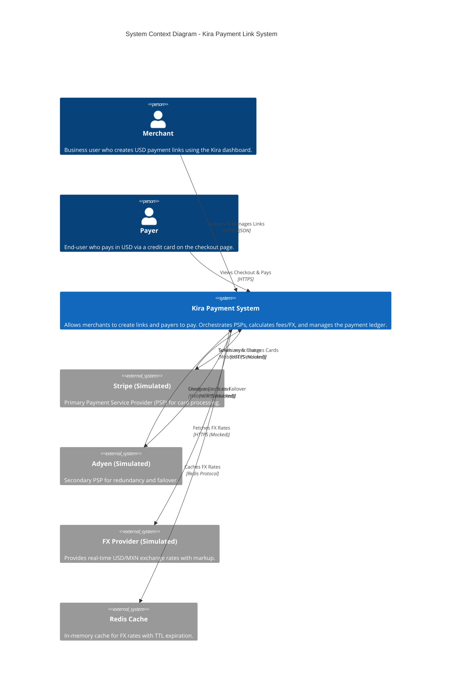
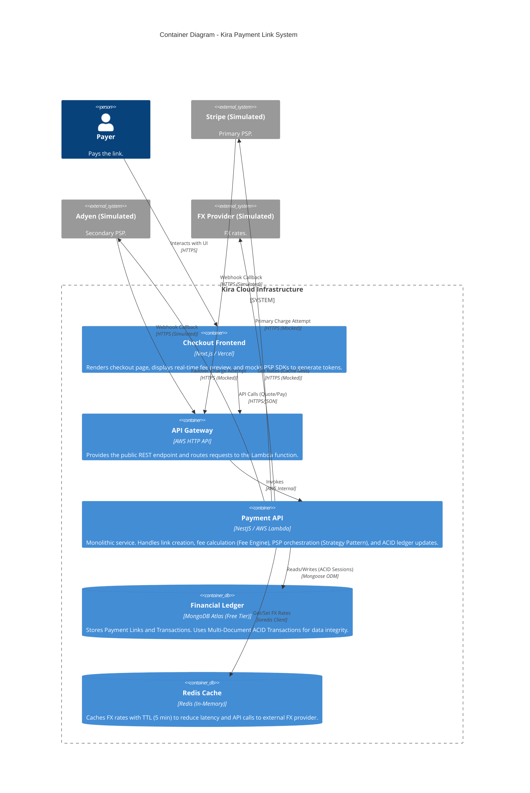
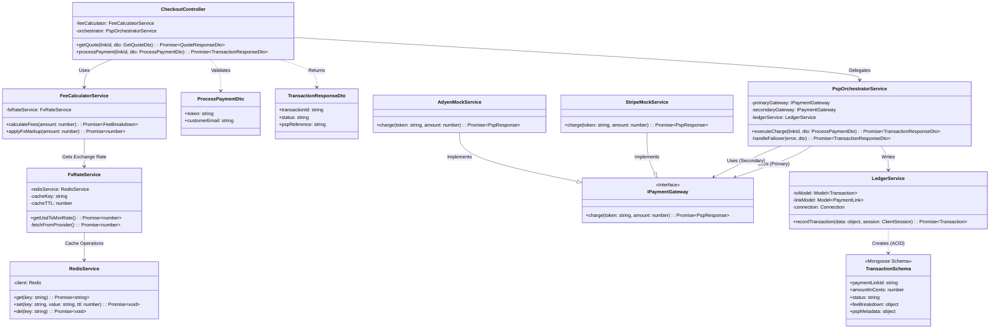

# Kira Payment Link System - C4 Architecture Diagrams

This document presents the architecture of the Kira Payment Link System (Case Study MVP) using the C4 model. The design is optimized for a serverless environment (AWS Lambda), uses a monolithic NestJS backend for agility, ensures financial data integrity (MongoDB ACID), and provides high resilience (PSP Orchestrator).

## Level 1: System Context Diagram

Shows the high-level interactions between the Merchant, the Payer, the Kira System, and the (Simulated) External Financial Providers.

## Level 2: Container Diagram

Shows the high-level technology choices: Next.js on Vercel for the frontend, NestJS on AWS Lambda for the backend, and MongoDB Atlas for the ledger.

## Level 3: Component Diagram

Shows the internal structure of the Payment API (NestJS) and how components collaborate to process a payment.

```mermaid
C4Component
  title Component Diagram - Payment API Container (NestJS)

  Container(api_gateway, "API Gateway", "AWS HTTP API")
  ContainerDb(database, "MongoDB", "Atlas")
  ContainerDb(redis, "Redis Cache", "In-Memory")
  System_Ext(stripe, "Stripe (Simulated)")
  System_Ext(adyen, "Adyen (Simulated)")
  System_Ext(fx_provider, "FX Provider (Simulated)")

  System_Boundary(backend_api, "NestJS Payment Module") {
    
    Component(merchant_controller, "Merchant Controller", "NestJS Controller", "Handles POST /links and GET /links.")
    Component(checkout_controller, "Checkout Controller", "NestJS Controller", "Handles POST /checkout/:id/quote and POST /checkout/:id/pay.")
    Component(webhook_controller, "Webhook Controller", "NestJS Controller", "Handles POST /webhooks/:provider for async PSP updates.")

    Component(link_service, "PaymentLink Service", "Domain Service", "Handles CRUD logic for PaymentLink entities.")
    Component(fee_calculator_service, "Fee Calculator Service", "Domain Service", "Applies chain of rules (Fixed, %, FX Markup, Incentives) to calculate total charges and fee breakdown.")
    Component(fx_rate_service, "FX Rate Service", "Domain Service", "Fetches USD/MXN rates from external provider with Redis caching (TTL: 5 min). Simulates API with random variations.")
    Component(psp_orchestrator_service, "PSP Orchestrator Service", "Domain Service", "Implements Strategy Pattern. Tries Primary (Stripe), catches errors, and executes Secondary (Adyen).")
    Component(ledger_service, "Ledger Service", "Infrastructure Service", "Manages MongoDB Sessions. Wraps all money-moving database operations in ACID transactions.")
    Component(redis_service, "Redis Service", "Infrastructure Service", "Provides caching capabilities with TTL support using ioredis client.")

    Component(psp_strategy, "IPaymentGateway", "TypeScript Interface", "Defines the contract for PSPs (`charge()`).")
    Component(stripe_mock, "StripeMock Service", "PSP Implementation", "Implements IPaymentGateway. Simulates Stripe behavior with jitter and random failures.")
    Component(adyen_mock, "AdyenMock Service", "PSP Implementation", "Implements IPaymentGateway. Simulates Adyen behavior.")

    Component(link_model, "PaymentLink Model", "Mongoose Schema", "Stores merchant config, amount (cents), and link status.")
    Component(tx_model, "Transaction Model", "Mongoose Schema", "Stores payment status, snapshot of fee breakdown, and PSP metadata (reference, provider).")
  }

  Rel(api_gateway, merchant_controller, "Routes /links", "HTTP")
  Rel(api_gateway, checkout_controller, "Routes /checkout", "HTTP")
  Rel(api_gateway, webhook_controller, "Routes /webhooks", "HTTP")

  Rel(merchant_controller, link_service, "Uses", "NestJS Injection")
  Rel(checkout_controller, fee_calculator_service, "Calculates Quote", "Method Call")
  Rel(checkout_controller, psp_orchestrator_service, "Executes Payment", "Method Call")
  
  Rel(fee_calculator_service, fx_rate_service, "Gets Current Rate", "Method Call")
  Rel(fx_rate_service, redis_service, "Check Cache", "Method Call")
  Rel(fx_rate_service, fx_provider, "Fetch Rate (Cache Miss)", "Mocked HTTP")
  Rel(redis_service, redis, "Get/Set with TTL", "ioredis")

  Rel(psp_orchestrator_service, psp_strategy, "Uses", "Strategy Interface")
  Rel(psp_orchestrator_service, ledger_service, "Writes Transaction (ACID)", "Method Call")
  Rel(psp_strategy, stripe_mock, "Is implemented by", "TypeScript")
  Rel(psp_strategy, adyen_mock, "Is implemented by", "TypeScript")
  
  Rel(stripe_mock, stripe, "Simulates", "Mocked HTTP")
  Rel(adyen_mock, adyen, "Simulates", "Mocked HTTP")

  Rel(webhook_controller, ledger_service, "Updates TX Status (ACID)", "Method Call")

  Rel(link_service, link_model, "Reads/Writes", "Mongoose")
  Rel(ledger_service, tx_model, "Reads/Writes", "Mongoose")
  Rel(ledger_service, link_model, "Reads/Writes", "Mongoose")

  Rel(link_model, database, "Persists to", "MongoDB")
  Rel(tx_model, database, "Persists to", "MongoDB")
```

## Level 4: Code Diagram

Shows the class-level structure for the core payment flow: CheckoutController -> PspOrchestratorService -> LedgerService.

---

**Document Version:** 1.1  
**Last Updated:** November 13, 2025  
**Context:** Kira Product Engineer Case Study
