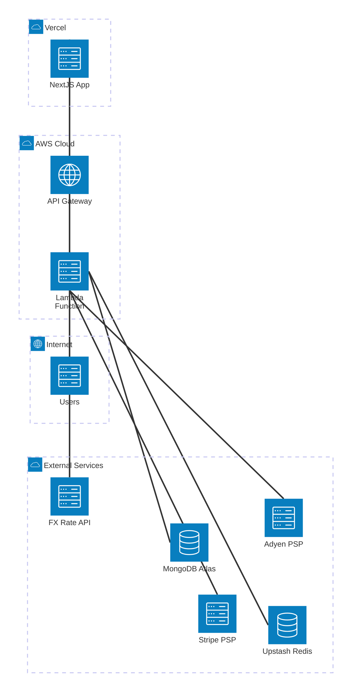

# Kira Payment Link - Architecture Diagram

This diagram shows the complete architecture for the Kira Payment Link application, including frontend, serverless API, caching, database, and external payment providers.

## Architecture Overview

### Client Layer
- **Users**: End users accessing the payment link system
- **Next.js Web Application**: Frontend deployed on Vercel
  - Checkout UI for payment processing
  - Payment link creation interface
  - Hosted on Vercel's edge network

### AWS Serverless Layer
- **API Gateway HTTP API**: Entry point for all API requests
  - RESTful API endpoints
  - HTTPS only
  - Route all requests to Lambda function
  
- **Lambda Function**: Node.js 20 runtime
  - NestJS API application
  - 512MB memory allocation
  - 30 second timeout
  - Handles all business logic
  - Environment variables managed via GitHub Actions

### Cache Layer
- **Upstash Redis**: Serverless Redis cache
  - Session management
  - Rate limiting
  - Payment state caching
  - Hosted on Upstash cloud
  - TLS encrypted connections

### Data Layer
- **MongoDB Atlas**: Primary database
  - Payment links storage
  - Transaction records
  - Fee profiles
  - Merchant data
  - Managed MongoDB cluster
  - Cloud-hosted with automatic backups

### Payment Service Providers
- **Stripe**: Card payment processing
  - Primary PSP for card payments
  - Webhook integration for payment status
  - PCI compliant
  
- **Adyen**: Alternative payment methods
  - Secondary PSP option
  - Webhook integration
  - Multi-currency support

### FX Rate Service
- **FX Rate API**: Real-time currency conversion
  - Exchange rate lookup
  - Multi-currency support
  - Cached in Redis for performance

## Data Flow

### Payment Link Creation
1. User accesses Web App
2. Web App sends request to API Gateway
3. API Gateway routes to Lambda
4. Lambda validates and creates payment link
5. Payment link stored in MongoDB Atlas
6. Response cached in Upstash Redis
7. Payment link returned to user

### Payment Processing
1. User accesses payment link via Web App
2. Web App fetches payment details from API
3. Lambda retrieves data from cache (Redis) or database (MongoDB)
4. User submits payment information
5. Lambda processes payment via Stripe/Adyen
6. Transaction stored in MongoDB Atlas
7. Payment status cached in Redis
8. Webhook confirmation from PSP
9. Transaction updated in database

## Security

- **HTTPS Only**: All communications encrypted
- **Environment Variables**: Sensitive data managed via GitHub Secrets
- **TLS Connections**: Redis and MongoDB use encrypted connections
- **PSP Integration**: PCI compliant payment processing
- **Rate Limiting**: Implemented via Redis
- **CORS**: Configured origins for web app

## High Availability

- **Serverless Lambda**: Auto-scaling based on demand
- **API Gateway**: Managed service with built-in redundancy
- **Vercel Edge Network**: Global CDN for web app
- **MongoDB Atlas**: Multi-region replication
- **Upstash Redis**: Managed Redis with high availability

## Deployment

- **Infrastructure**: Terraform (Lambda + API Gateway)
- **API Deployment**: GitHub Actions (automatic on push to master)
- **Web Deployment**: Vercel (automatic on push)
- **Environment Variables**: GitHub Secrets → Lambda
- **Monitoring**: CloudWatch Logs for Lambda

## Technology Stack

### Frontend
- Next.js
- React
- Tailwind CSS
- shadcn/ui

### Backend
- NestJS
- Node.js 20
- TypeScript
- Mongoose (MongoDB ODM)
- ioredis (Redis client)

### Infrastructure
- AWS Lambda
- AWS API Gateway
- Terraform
- GitHub Actions

### External Services
- Vercel (hosting)
- Upstash Redis (cache)
- MongoDB Atlas (database)
- Stripe (payments)
- Adyen (payments)
